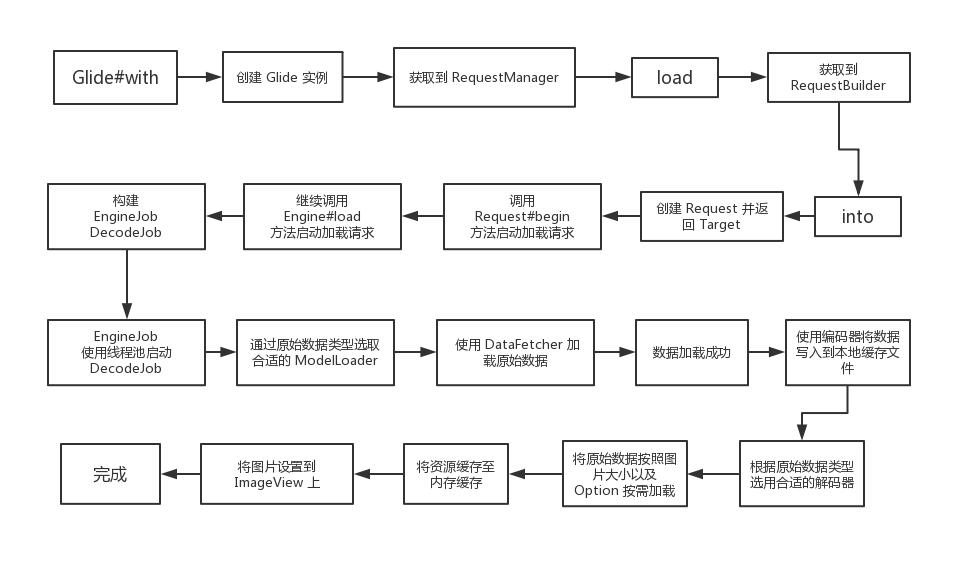

# Glide

Glide --with--> RequestManager -- asXXX --> RequestBuilder <--> load/transform/apply -- into --> Target 

## Glide 感知 View 的声明周期

glide 的 with 可以填入任意的带 context 的对象，用于感知生命周期，当 View 被销毁的时候，自动取消加载数据。with 方法很多，最终都会变成三种类型的

1. 后台线程加载或者传入的参数的 context 为 applicationConext 的，都会使用 Application.Context 获得 `RequestManager`。

2. 如果前台线程获取，view 和 activity 都会获取 FragmentManager 添加一个隐藏的 `Fragment` 用于监听 Fragment 或者 Activity 的销毁。

## load / tranform/ apply

asXXX 和 load 方法基本什么也没做，主要是确定加载资源的类型和加载地址。保存在 RequestBuilder 中，并返回。

## into

into 主要做以下几件事

1. 主要是调用 `GlideContext` 的 `buildImageViewTarget` 创建 `Target` 用于加载成功后的回调设置图片。

2. `buildRequest` 用于构建请求，和指定执行的线程。

3. 调用 `RequestManager.track(target, request);` 记录 `Target`，并且调用 `SingleRequest.`发出加载请求。

https://blog.csdn.net/u013872857/article/details/88691826?utm_medium=distribute.pc_relevant_right.none-task-blog-BlogCommendFromMachineLearnPai2-2.nonecase&depth_1-utm_source=distribute.pc_relevant_right.none-task-blog-BlogCommendFromMachineLearnPai2-2.nonecase

## 优化

1. 需要根据不同的图片设置不同的优化选项，对于加载一次就基本不会看第二次的图片，可以跳过缓存，例如文章内的图片，因为缓存图片也需要消耗时间，`skipMemoryCache(true)`。 而对于加载后要常重复时候的图片要缓存，例如用户头像。

2. 加载合适尺寸的图片，这个对于 glide 是强制的，对于 `into` 是 view 的会自动从 view 获取加载到内存的图片大小。而对于 submit 等，需要传入图片大小的参数。

3. 根据内存大小来选择合理的内存缓存大小，以及设置外部缓存大小和缓存策略。

4. 避免使用圆角图片，而是使用 View 圆角来先是圆角图片。因为 transform 会增加变换的时间以及，而且变换会新生成一个 `bitmap` 从而使内存使用翻倍。

