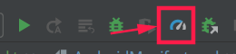
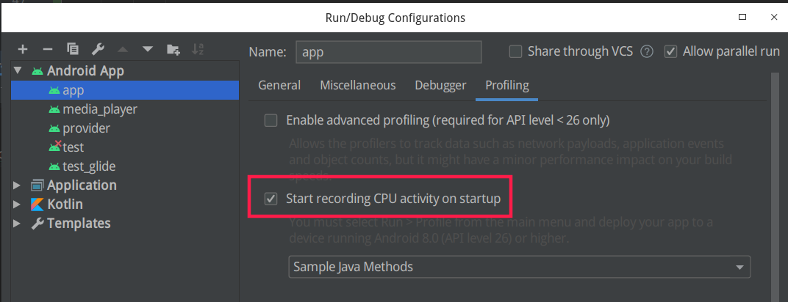
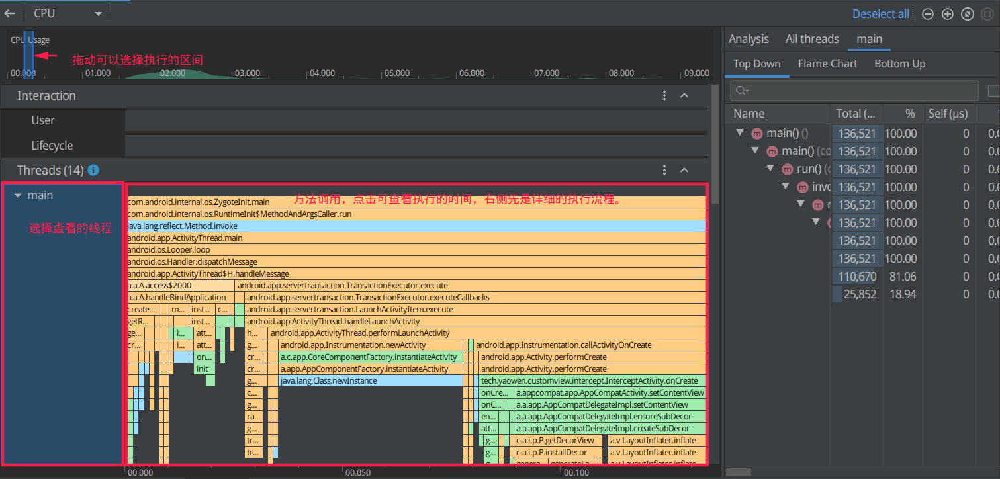

# Startup speed optimization

启动的类别：

1. 冷启动： app 需要从头启动
2. 温启动：application 还在，要启动的 Activiry 需要从新创建
3. 热启动：activity 在任务栈中，调起到前台即可。

启动优化主要关注冷启动，冷启动优化的好了，也能提高其他类型启动的速度（why?）。

## 启动调试工具

1. Android Profile

点击 profile 按钮启动

或者在 App 的 Run/Debug Configration -> Profiling 的 Tab 中选中 `Start recording CPU activity on startup`

运行之后，在 Profile 面板中点击 CPU 进入 CPU 的详情。

在对应用程序进行性能分析时，Android Profiler 使应用程序比平时有一些延迟和变慢。

该方法底层就是用的 `Systrace` 指令，通过有时候的错误报告 `System trace file` 无法解析也能窥见一点。

2. adb

3. 

https://www.jianshu.com/p/59a2ca7df681
https://www.jianshu.com/p/bef74a4b6d5e
https://blog.csdn.net/vicwudi/article/details/100191529
https://www.jianshu.com/p/e0d2b6347414
https://medium.com/@huynhtanngan/how-to-speed-up-android-app-cold-start-time-by-50-8924425f4c6f

https://blog.csdn.net/sinat_20059415/article/details/80584621?utm_source=blogxgwz5

布局优化 

https://www.jianshu.com/p/11da1f852198

## 冷启动

Loading and launching the app.
Displaying a blank starting window for the app immediately after launch.
Creating the app process.

①点击桌面App图标，Launcher进程采用Binder IPC向system_server进程发起startActivity请求；

②system_server进程接收到请求后，向zygote进程发送创建进程的请求；

③Zygote进程fork出新的子进程，即App进程

## 启动优化

1. 自定义的 Application 的 onCreate 中减少操作。创建独立的线程运行。
2. 如果有相关的 ui 操作要初始化，把代码移动到第一个启动页，在该页面渲染后再执行初始化操作。
3. 要初始化的内容在产品中使用不是首屏就必要的，使用前再初始化，没必要提前初始化。
4. 使用量 MultiDex 的话，判断 sdk 版本，5.0 之后自带分文件，没必要使用。
5. 为第一个启动的 Activity 设置背景图，或者设置透明背景。

> 启动模式

1. 避免应用冷启动，8.0 之前保活，8.0 开始，保活基本不可能。只有和厂商合作。

> 包体积

包内容

- Dex 文件
- Resource
- Assets
- Native Libraries

不太可优化的内容。 Dex 压缩，Facebook Dex 压缩工具还不太成熟。
主要是删除不必要的依赖，以及减少依赖的使用，或者能使用的仅使用部分。

类加载器：

Java 类加载器

- Bootstrap ClassLoader： 最顶层的加载类。
- Extension ClassLoader: 扩展类加载器
- App ClassLoader: 也成为 SystemAppClass 加载当前应用的 classpath 的所有类。

也是向上委托的。

Android 中的类加载器

PathClassLoader 是用来加载 Android 系统类和应用类。
DexClassLoader 支持加载 apk、dex 和 JAR，也可以从 SD 卡进行加载。

在 8.0 只后就没有差别了。

2. 压缩资源

Webp 格式，比 jgp 一般能少 30% 左右，android studio 已经有相应的工具。

3. gradle 中配置

resources.arsc 中是支持的配置类型种类。

- ndk 支持 4.0 以上支持 abi-v7a 就可以了。 x86 基本也都支持 abi-v7a.

- 依赖中也有支持国际化的内容，可以配置支持的语言来去国际化。

- 去除不适用的文件。

- 混淆也会使包体积变小。变量名等变小了。JNI 不能混淆，反射的不能混淆。JSON 解析不能混淆。

## 启动流程

Android 系统启动的流程

Boot Loader -> Linux Kernel -> Android 系统服务

而第一个启动的进程是 init 进程，然后由 init 进程创建出其他进程（其中就有 Zygote 进程）。

https://blog.csdn.net/a15110103117/article/details/103430428

https://juejin.im/post/5dda8504e51d452306073434#heading-7

