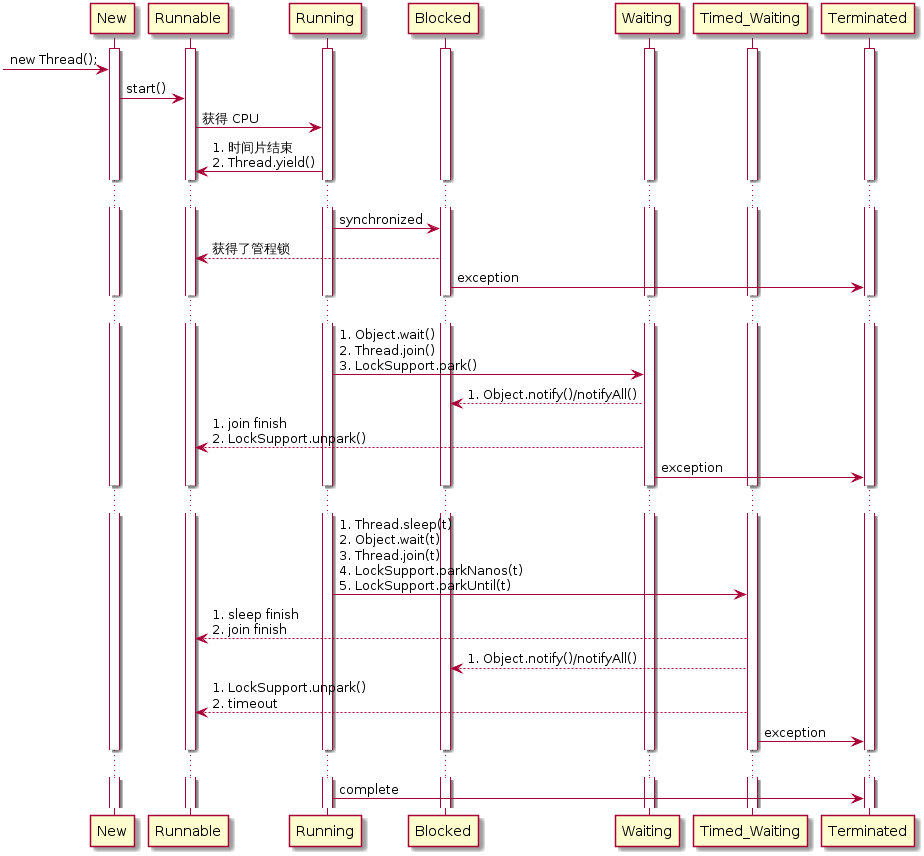

算法+ 数据结构

设计模式 多线程 JVM


[TOC]

# 进程与线程

进程和线程的区别，就像雷锋和雷锋塔，或者 Java 和 JavaScript 不能说毫无关系，只能说关系不大。要理解两者的区别，从其原先的英语名字能更好的理解。毕竟其发明者的母语是英语。

进程: Process

关于进程的定义有很多，一个经典的定义是一个执行中程序的实例，进程是程序的动态表现。

是对处理器 Processor 的抽象。在早期的计算机上只能运行一个程序，它占有这个 CPU 全部内存空间和资源。一次只能运行一个程序无法满足人们的想要处理多个任务的需求。为了完成在同一台计算同时运行多个程序的目的，将运行的程序抽象为一个进程，CPU 通过快速的切换这些进程，表现的像多个程序同时运行的样子。对于这些程序来说，它们好像独占了 CPU，并不知道有其他程序在统一 CPU 上运行，所谓独占就是整个地址空间都是它自己的，比如 32 为计算机的地址是 0 ~ 4G，这所有的地址它都可以访问的。例如 Linux 上的地址分配为

这也是为什么说进程是分配资源的基本单位。


线程: Thread

从名字看出来 Thread 和 Process 完全是两个概念。在一个程序内部（也就是一个进程）也有同时运行多个任务的需求，例如在一个音乐软件，即便播放音乐，还要能让人继续浏览其他的内容。并发的任务，其实就是并发执行的多个程序片段。为了在同一软件中同时执行多个任务，计算机研究的先驱为了抽象这种同时执行的程序，提出了 Thread 的概念。由于这些线程在同一个程序内，他们共享地址空间。这也是他们共享资源的根本原因，直接可以通过地址访问到其它线程的资源。


进程是60年代初首先由麻省理工学院的MULTICS系统和IBM公司的CTSS/360系统引入的。

80年代，出现了能独立运行的基本单位——线程（Threads）

进程无父子关系，各个进程是独立的。
线程有父子关系，父线程终止，全部子线程被迫终止(没有了资源)。子线程终止不会影响父线程。


## 进程能不创建线程吗？

计算机硬件不区分什么是进程，什么是线程，只是运行的片段。进程和线程是操作系统的概念，在早期以进程为调度的系统上，可以不创建线程。而现代 OS 以线程为调度单位，其进程一旦运行就是线程，也即主线程。
以 Linux 为例，其进程和线程都是同一个数据结构：

```C
struct task_struct {
    ...
	pid_t				pid;
	pid_t				tgid; //thread group id
    ...
}
```

Linux 2.6 开始实现 NPTL 模型的线程。 task_struct 结构中增加了一个tgid(thread group id)字段，表示线程组。

从内核的角度看，每个线程都有自己的 ID, 使用的是 pid 字段（个人猜测是因为历史原因，Linux 2.6 之前线程的实现的是 LWP(轻量级进程)，也即每个线程都一个进程在调度，使用的是进程 ID.），其实命名为 tid 更合适。而进程 ID 则使用 tgid 字段。如果一个进程是主进程时，其 `pid` 等于 `tgid`。

```
// https://stackoverflow.com/questions/9305992/if-threads-share-the-same-pid-how-can-they-be-identified

                         USER VIEW
                         vvvv vvvv
              |
<-- PID 43 -->|<----------------- PID 42 ----------------->
              |                           |
              |      +---------+          |
              |      | process |          |
              |     _| pid=42  |_         |
         __(fork) _/ | tgid=42 | \_ (new thread) _
        /     |      +---------+          |       \
+---------+   |                           |    +---------+
| process |   |                           |    | process |
| pid=43  |   |                           |    | pid=44  |
| tgid=43 |   |                           |    | tgid=42 |
+---------+   |                           |    +---------+
              |                           |
<-- PID 43 -->|<--------- PID 42 -------->|<--- PID 44 --->
              |                           |
                        ^^^^^^ ^^^^
                        KERNEL VIEW
```


每个 task_struct 的 pid 都不同。所以从内核调度来看，线程和进程没什么区别。

参考 [Linux的进程和线程的现状及其发展史简述](https://www.cnblogs.com/yudidi/p/12417285.html)
[](https://blog.csdn.net/adcxf/article/details/3940982)


> 为什么仍然有人坚称 Linux 的内核没有线程的概念，内核调度是是进程，而不是线程？

个人观点：Linux 实现了线程。
原因：
线程还是进程，都是认为规定的概念，首先看下定义：进程是资源分配的基本单位，线程是调度的基本单位。Linux 没有在一诞生就实现多线程，实时上任何系统也不可能一诞生就是功能完备的。早起确实 Linux 只有进程，因此调度的也是进程。在实现线程的过程中，Linux 简化了实现，首先是用轻量级进程（LWP）实现的。所以后来 NPTL 实现，仍有人按照原来的说法，认为内核调度的是轻量级进程，而且 Linux 仍然沿用了 task_struct 的数据结构。但是首先要说明的是，数据结构不是能代表它是线程还是进程，而是人们对于线程和进程的定义：”进程是资源分配的基本单位“，当一个程序加载进内存，创建 task_struct 并分配地址空间，则它是一个进程。在程序进入调度，开始运行，则它是一个线程。因为“线程是调度的基本单位”。

另一个支持 Linux 只有进程的说法是：不是只有线程可以调度，进程也是可以调度的。这个我是同意的，因为在没有线程的系统上，进程确实是调度的基本单位，这也是早起 Linux 的实现方式。然而，这很容易反驳，线程是空闲资源的，根本就是共享内存空间。如果创建一个 task_struct，它跟已有的 task 共享了内存空间，那它就共享资源，也即创建的是一个线程。


Linux 的进程和线程同时用一个数据结构表示，完全不违反任何概念，没有谁说进程和线程是完全独立，不可相连的。而使用同一数据结构有其历史原因（历史上实现的进程调度），也有其 KISS 的设计理念，使整个系统的实现变得简单。

### 线程模型

多线程的实现不止在系统内核中，也可以使用应用程序层实现，这种实现不是由系统调度的，而是通过软件的长跳转(longjump），称为用户线程。由于应用线程调度仅仅是一个跳转，不像内核线程需要保存寄存器等状态，用户线程往往更高效。由于不同的线程实现，就有了实际应用中三种不同线程模型。

#### 1:1

一个应用线程对应一个内核线程。这种实现方式用户线程并没有实现线程调度，线程仅仅是对内核线程的封装，以提供一个套简洁一致的 API。例如 Java 的线程就是对各个平台线程的封装。

缺点：线程调度由内核调度，性能不如其它模型高。

#### 1:N

一个内核线程对应 N 个用户线程。由应用程序完成线程的调度。这种实现通常在一些没有内核线程的系统上，应用层通过自己实现线程调度来实现并发。

缺点：无法实现高并发

#### M:N

这种线程也称为混合线程模型。N 个用户线程依附于 M 个内核线程。这种实现避免了比 1:1 线程更加高效，同时避免了 1:N 模型中无法实现抢占式调度。

缺点：实现过于复杂。

多线程实现的现状：

主流的系统都在转为 1:1 的线程模型。虽然 M:N 模型更高效，但是其实现过于复杂，在现代计算机越来越倾向于多核化，以及一些超标量流水线技术等支持，再加上 N:M 实现需要的复杂的代码消耗，M:N 实现带来性能提升并不与其付出成比例。过高的实现复杂度带来的性能回报并不高。

Linux 上 M:N 模型的 NGPT 实现，在 2003 年中期被放弃了，把这个领域完全留给了 NPTL。
有个说法没有验证：
FreeBSD从7.0开始转为 1:1 实现。
Solaris 之前实现了 M:N 线程模型，从某个版本也开始转移到 1:1 模型。

Java 也遗弃了 M:N 的线程模型。现在线程仅仅是对内核线程的一个封装。


## 线程撕裂者/超线程

一个 ALU 同一时刻只能执行一个程序。


## 为什么线程比进程轻量？

1. 创建开销
2. 调度开销


线程切换不需要更换页表，而进程切换需要。
页表切换缓存失效，性能低

进程切换比线程切换开销大是因为进程切换时要切页表，而且往往伴随着页调度，因为进程的数据段代码段要换出去，以便把将要执行的进程的内容换进来。本来进程的内容就是线程的超集。而且线程只需要保存线程的上下文（相关寄存器状态和栈的信息）就好了，动作很小

2、另外一个隐藏的损耗是上下文的切换会扰乱处理器的缓存机制。简单的说，一旦去切换上下文，处理器中所有已经缓存的内存地址一瞬间都作废了。还有一个显著的区别是当你改变虚拟内存空间的时候，处理的页表缓冲（processor's Translation Lookaside Buffer (TLB)）或者相当的神马东西会被全部刷新，这将导致内存的访问在一段时间内相当的低效。但是在线程的切换中，不会出现这个问题。


协程编程模型更好？
协程能够取代线程？
为什么系统不引入协程？
多个线程的实际堆栈是怎样的？


> 如何达到最好的运行效率？

协称是在线程之上的，它怎么就比线程高效了？多少个线程能在单个系统上达到最高的运行效率？

线程切换的效率，当线程少的时候，是否能独占系统，不用切换？
当线程多的时候，是否效率会变化？切换的时间片是否根据线程数量改变？


## 线程上下文

一个整数线程 ID
栈
栈指针
程序计数器
通用目的的寄存器和条件码？

与同一进程中的其它线程共享整个进程的虚拟地址空间
包括代码、数据区域、堆、共享库、和打开的文件。

线程的上下文要比进程的上下文小得多，线程上线文切换要比进程上下文切换快的多。
不同于进程的严格父子层次关系组织，一个进程内的线程组成一个线程对等池。对等影响是，一个线程可以杀死任意的线程，或者等待其结束。每个对等线程都可以读写共享的数据。

**寄存器是从不共享的，而虚拟存储器总是共享的**


## 线程安全

在拥有共享数据的多条线程并行执行的程序中，线程安全的代码会通过同步机制保证各个线程都可以正常且正确的执行，不会出现数据污染等意外情况

> 问题产生的原因

1. 多个线程在同时操作共享的数据
2. 操作共享数据的代码有多条

当一个线程执行操作共享数据的多条代码时，由于线程切换是随机的，会导致执行过程中，数据被其他线程更改。这样使数据产生预期之外的值。

为了解决这个问题，需要线程同步，即对同一个数据的一块操作必须整体要么执行完，要么不执行。不能被其它线程打断。实现操作的原子性。

使用 synchronized 或者　Lock 实现线程同步。

## 线程同步

即当有一个线程在对内存进行操作时，其他线程都不可以对这个内存地址进行操作（处于等待状态），直到该线程完成操作，其他线程才能对该内存地址进行操作。

“同”字从字面上容易理解为一起动作
其实不是，“同”字应是指协同、协助、互相配合。

- 好处：解决了线程安全的问题

- 弊端：降低了线程的执行效率，因为同步外的线程都会判断锁，所得获取和释放都需要额外的操作。

实现同步的前提是，要实现同步的所有线程使用同一个锁。

线程同步几种方式。

- 临界区（CCriticalSection）：通过对多线程的串行化来访问公共资源或一段代码，速度快，适合控制数据访问。

- 事件（CEvent）：为协调共同对一个共享资源的单独访问而设计的。

- 互斥量（CMutex）：为控制一个具有有限数量用户资源而设计。

- 信号量（CSemaphore）：用来通知线程有一些事件已发生，从而启动后继任务的开始。


## 线程安全的三个条件

volatile

- 可见性：

　　可见性是一种复杂的属性，因为可见性中的错误总是会违背我们的直觉。通常，我们无法确保执行读操作的线程能适时地看到其他线程写入的值，有时甚至是根本不可能的事情。为了确保多个线程之间对内存写入操作的可见性，必须使用同步机制。

　　可见性，是指线程之间的可见性，一个线程修改的状态对另一个线程是可见的。也就是一个线程修改的结果。另一个线程马上就能看到。比如：用volatile 修饰的变量，就会具有可见性。当把变量声明为volatile类型后，编译器与运行时都会注意到这个变量是共享的，因此不会将该变量上的操作与其他内存操作一起重排序。volatile变量不会被缓存在寄存器或者对其他处理器不可见的地方，因此在读取volatile类型的变量时总会返回最新写入的值。，即直接修改内存。所以对其他线程是可见的。但是这里需要注意一个问题，volatile只能让被他修饰内容具有可见性，但不能保证它具有原子性。比如 volatile int a = 0；之后有一个操作 a++；这个变量a具有可见性，但是a++ 依然是一个非原子操作，也就是这个操作同样存在线程安全问题。

volatile变量的内存可见性是基于内存屏障(Memory Barrier)实现的，什么是内存屏障?内存屏障，又称内存栅栏，是一个CPU指令。在程序运行时，为了提高执行性能，编译器和处理器会对指令进行重排序，通过插入特定类型的内存屏障来禁止特定类型的编译器重排序和处理器重排序，插入一条内存屏障会告诉编译器和CPU：不管什么指令都不能和这条Memory Barrier指令重排序。

https://www.jianshu.com/p/08a0a8c984ab

　　在 Java 中 volatile、synchronized 和 final 实现可见性。

- 原子性：

　　原子是世界上的最小单位，具有不可分割性。比如 a=0；（a非long和double类型） 这个操作是不可分割的，那么我们说这个操作时原子操作。再比如：a++； 这个操作实际是a = a + 1；是可分割的，所以他不是一个原子操作。非原子操作都会存在线程安全问题，需要我们使用同步技术（sychronized）来让它变成一个原子操作。一个操作是原子操作，那么我们称它具有原子性。java的concurrent包下提供了一些原子类，我们可以通过阅读API来了解这些原子类的用法。比如：AtomicInteger、AtomicLong、AtomicReference等。

　　在 Java 中 synchronized 和在 lock、unlock 中操作保证原子性。

- 有序性：

　　Java 语言提供了 volatile 和 synchronized 两个关键字来保证线程之间操作的有序性，volatile 是因为其本身包含“禁止指令重排序”的语义，synchronized 是由“一个变量在同一个时刻只允许一条线程对其进行 lock 操作”这条规则获得的，此规则决定了持有同一个对象锁的两个同步块只能串行执行。


> 当一个变量定义为 volatile 之后，将具备两种特性：

　　1.保证此变量对所有的线程的可见性，这里的“可见性”，当一个线程修改了这个变量的值，volatile 保证了新值能立即同步到主内存，以及每次使用前立即从主内存刷新。但普通变量做不到这点，普通变量的值在线程间传递均需要通过主内存（详见：Java内存模型）来完成。

　　2.禁止指令重排序优化。有volatile修饰的变量，赋值后多执行了一个“load addl $0x0, (%esp)”操作，这个操作相当于一个内存屏障（指令重排序时不能把后面的指令重排序到内存屏障之前的位置），只有一个CPU访问内存时，并不需要内存屏障；（什么是指令重排序：是指CPU采用了允许将多条指令不按程序规定的顺序分开发送给各相应电路单元处理）。

volatile 性能：
　　volatile 的读性能消耗与普通变量几乎相同，但是写操作稍慢，因为它需要在本地代码中插入许多内存屏障指令来保证处理器不发生乱序执行。

　　volatile 的可见性并不是缓存一致性，而是缓存锁或者总线锁。

> synchronized 后，不需要加 volatile

synchronized 既保证了原子性有保证了可见性。

## 可重入

可重入是指已经获取锁的进程可以在内部调用另一个要获取同一把锁的代码。


```Java
class T {
    void synchronized a {
        b();
    }

    void synchronized b {

    }
}
```

a 和 b 要获取同一把锁，在同一个线程中 a 可以调用 b。 这是必须的。因为如果不允许可重入锁。继承的 synchronized 调用 super 将会导致死锁。

```Java
class T {
    protect void synchronized a {
        //...
    }
}

class V extends T {
    protect void synchronized a {
        super.a();
    }
}
```

如果不允许可重入，A.a 在调用 super.a() 时，因为获取不到锁，而产生死锁。因为此时都要获取 V 的对象。

## 获取锁程序产生异常，会释放锁。

如果不想释放锁，可以 catch 处理。

## synchronized 底层实现

synchronized 早期重量级，向系统申请。
后来改造，

执行时间长适合用系统锁/线程数量比较多。
执行时间短且线程数量比较少适合用自旋锁。

## Thread Executor, HandlerThread, AsyncTask 怎么选

如果想要执行后台任务，不与前台交互，可以使用, Thread　或者　Executor，而且推荐使用　Executor 线程池。

如果与前台频繁交互，例如下载进度条等则可以使用 AsyncTask，而　HandlerThread 基本没有什么使用场景。如果一次性交互，可以使用 Handler 或者其他切换线程的库。

Service 和　IntentService（带有单线程的后台一次性 Service，执行完后就自动退出了）。Servide 主要处理长时间的任务，除非用户为其他应用提供服务或者播放器等用户服务。否则都不建议使用，而是使用 DownloadManager 或者 TaskManager 代替。


## 实现 Rannable 接口的好处

1. 线程的任务从线程子类中分离处理，进行单独的封装，更符合面向对象的思想。
2. 避免 Java 单继承的局限性。


## 几种创建 Thread 的方法

1. 继承 Thread 类，重写　run 方法。
2. 实现 Runnable 接口。传递给　Thread 对象。同时覆盖和传递 runnable 将执行 Thread 自身覆盖的 `run` 方法。
3. ThreadFactory，其实内部还是自己 New Thread。只不过可以用与生产一批类似的线程。
4. Excturor 线程池，不用时及时关闭 shutdown。
    1. 单线程的线程池　singleThreadExecutor()。可以指定执行的顺序（FIFO,LIFO）/
    2. 固定数量线程池 fixedThreadExecutor()
    3. 可以动态增长的线程池 newCachePoolExecutor() 不限制数量
    4. newScheduledThreadPool 支持定时及周期执行任务。
5. Callable 有返回值的线程，通过 `Future.get()` 获取结果

## 线程间通信

包括 wait(), notify(). notifyAll()，join(), yield()。

1. 这些方法都必须在同步代码块内使用。因为这些方法都是用于操作线程状态的方法，必须要明确到底要操作的是哪个锁上的线程。
2. 为什么这些方法内定义在了 Object 类中？ 因为这些方法是监视器方法，监视器可以是任意对象，任意对象都有的方法一定是在 Object 中。


## 线程阻塞

该线程放弃 CPU 的使用，暂停执行。只有等到导致阻塞的原因消除之后才能运行。

1. sleep(), wait(), yield(), join(),(suspend(), resume() 已废弃)
2. 执行一段代码无法获得相关锁。
3. IO 操作等待相关资源。

有争议的地方，Java 中对阻塞的定义


```
BLOCKED：Thread state for a thread blocked waiting for a monitor lock.
A thread in the blocked state is waiting for a monitor lock　to enter a synchronized block/method or　reenter a synchronized block/method after calling　｀Object.wait｀
```

## 线程的状态图




## interrupt 和 stop 的区别，为什么 stop 被废弃。

- interrupt 是在线程中设置了一个标志位，需要在 `run` 方法中自己判断标志位来终止。`Thread.isInterrupe()` 会在返回之后，把标志位置为 true，这样方便下次再次执行；而 `isInterrupt()` 不会设置标志位。
- stop　方法类似将线程　kill 掉，结果不可预期。释放它已经锁定的所有监视器。可能产生数据的不一致性。已经被废弃。

- 正在 `sleep` 的线程，被执行 `interrupt()` 将会终止休眠，同时抛出 `InterruptedException`，此时捕获异常可以做一些善后工作。
- Android 中有个 `SystenClock.sleep()` 不会抛出 ｀InterruptedException`，同时也不会被打断休眠状态，可以用于特殊情况。

```
try {
    Thread.sleep(1000)
} catch (ex: InterruptedException) {
    // 正在睡的时候，执行了 `interrupt` 将会直接被激活，然后抛出 `InterruptedException`
}
```

## 线程停止方法的比较。

1. stop 方法不安全，已经使用 interrupt 代替。
2. run 方法结束，或者判断`isInterrupt`标记位。线程可能被 wait 后进入到冻结动态，无法恢复或者判断标记位。可以使用 interrupt() 将线程中冻结或者休眠状态激活重新获得执行资格。

## 线程操作方法介绍

> join

在一个线程中调用另一个线程的 `join`，会等待另一个线程执行完毕之后，才执行后面的代码。join 的线程并不会立即执行，而是和其他具有执行权的线程进入分配队列等待线程调度。

> yield()

正在执行的线程获取到了执行时间片，执行 `yield()` 时，会主动让出时间片，然后到排队等待的队列中等待下一个时间片。

> setDeamon(true)

设置线程为守护线程。普通线程会阻塞进程，所有线程都结束后才会结束进程。而守护线程优先级比较低，不会阻塞进程结束。

1. 开启和任何操作都和普通线程一样。只需要设置线程 `setDeamon(true)`

> 优先级

获取 CPU 执行的记录，即线程调度的权重。1~10

MAX_PRIORITY = 10
NORM_PRIORITY = 5
MIN_PRIORITY = 1

> 线程组

在构造函数中指定，可以集体判断等操作处理。

## 多生产者多消费者关系

1. 为了防止被同类唤醒，而又不需要运行，要循环判断标记位。
2. 为了防止循环判断成立时有进入等待状态，从而全部进入等待状态，而进入死锁，要用 notifyAll 唤醒所有线程，一定会唤醒对象线程。


## wait 和　sleep　的区别

1. wait 可以指定时间，也可以不同指定。
2. 在同步中时，对　cup 的执行权的实例方式不同。wait 释放执行权，释放锁。sleep 释放执行权，但不释放锁。


## 加锁的类型

1. 同步代码快
2. 同步函数。
    1. 并不是所有内容都可以放在同步函数中。
    2. 同步函数的锁不是 Object，而是 this 对象。
3. 静态同步函数
    锁的是当前类的字节码。this.getClasss(). 或者 <类名>.class
    t.getClass() 和 Ticket.class 等价

## synchronized 修饰的类型

1. 修饰方法
2. 修饰代码块

两者等价

```
public synchronized void method()
{
   // todo
}

public void method()
{
   synchronized(this/object) {
      // todo
   }
}

```

3. 修饰静态方法
4. 修饰类 `synchronized(ClassName.class) {}`

两者是等价的


## 不能继承

synchronized关键字不能继承。
虽然可以使用synchronized来定义方法，但synchronized并不属于方法定义的一部分，因此，synchronized关键字不能被继承。如果在父类中的某个方法使用了synchronized关键字，而在子类中覆盖了这个方法，在子类中的这个方法默认情况下并不是同步的，而必须显式地在子类的这个方法中加上synchronized关键字才可以。当然，还可以在子类方法中调用父类中相应的方法，这样虽然子类中的方法不是同步的，但子类调用了父类的同步方法，因此，子类的方法也就相当于同步了。

## Lock 优点

原锁为一个块的封装体，对锁的操作是隐式的，无法进行灵活的操作。到了 v1.5 将锁对象化，将隐式操作显式化，可以灵活地获取释放锁。

```
Lock lock = new ReetrantLock(); 可重入的互斥锁。
```

Lock.unLock() 要放在 `finally` 块中。

Condation 将 Object 监视方法（wait(),notify,notifyAll) 分解为截然不同的对象，以便将这些对象与任意 lock 实现组合，为每个对象提供多个等待的　set, 其中 Lock 代替了原有 synchronized 关键字的使用。condation　代替了 Ojeect 监视器方法的使用。

方法名的改变

wait　－> await
notify  －> signal
notifyAll －> signalAll


## 死锁

1. A 线程持有资源 x, 要获取 y。Ｂ 线程持有资源 y，要获取 x。

它们一定是双锁，同时产生了嵌套。一个获取了锁 a，代码块内部想要获取锁 b. 另一个线程获取了锁 b，内部同步代码执行时想要获取锁 a。由于是嵌套的，不获取的时候还释放不了 a。

## 单例模式的问题

单例的变量要使用 volatile 声明变量，保证基本数据类型的操作是线程同步的。例如虚拟机上 double 的赋值可能会被分成两步。防止变量还没初始化完成就返回引用供其他程序访问而出现　null 的情况。

volatile 不能保证对象，++,-- 等操作的线程安全。

对于`++`,`--` 这些操作，为了线程安全，如果使用 synchronized 则太重了。这时候可以使用带 `Atomic` 前缀的基本数据类型，它们的操作是原子性的。

1. 恶汉模式不存在线程安全。
2.


## 乐观锁和悲观锁


乐观锁是读数据的时候先不锁数据，假设别人不会修改数据，等到写入的时候再检查是否有修改，有修改再加锁，然后写入。

悲观锁是觉得别人会修改数据，在读取的时候就先加锁，写入完毕的时候再释放锁。


## 读写锁

只有两方都是读的时候不会出问题，不用加锁。否则只要有一方写，就不安全。

读写锁要在 finally 中释放锁。

```
val readWriterLock = ReentrantReadWriteLock()
val readLock = readWriterLock.readLock()
val writeLock = readWriterLock.writeLock()

var x = 0

fun testRead() {
    readLock.lock()
    try {
        println(x)
    } finally {
        readLock.unlock()
    }
}

fun testWrite() {
    writeLock.lock()
    try {
        x++
    } finally {
        writeLock.unlock()
    }
}
```


# 协程

Kotlin 协程由于要和 Java 互操作和运行在 Jvm 之上，其本质上还是对线程的一个封装，底层是靠线程实现的。

## 挂起

挂起是挂起整个携程，挂起点之后的代码不再执行，而是转而执行其他携程。

## 挂起函数

并不是执行到这个函数就挂起了，而是函数内部可能包含有能够使携程挂起的代码，在函数内的代码执行到挂起代码的时候，携程被挂起。被 `suspend` 修饰的函数不应定有挂起代码，也不定会时携程挂起。由于挂起只能出现在携程内部，该修饰符就是为了给编译器标识函数万一有挂起函数，只能用于携程内部，用于安全检查的。


## 创建

1. luanch
2. sync
3. runBlocking

调度器

1. Dispatchers.Unconfined
2. Dispatchers.IO 对 IO 操作做了优化
3. Dispatchers.Default 适用于 CPU 密集型操作
5. Dispatchers.Main  安卓库独有


## Atomic 类

https://www.jianshu.com/p/84c75074fa03

## 线程多少合适？

如果是 CPU 密集型，线程数量等于 CPU 核数能达到最大的计算效率。例如 Retrofit 的 Scheulers.computation
根据是非 CUP 密集型，例如网络传输，可以任务多个。例如 Retrofit 的 Scheulers.io。

## 线程本地存储

也就是线程的上下文，包括栈指针、程序计数器以及通用目的的寄存器。

https://blog.csdn.net/linyt/article/details/51931737
https://www.cnblogs.com/liu6666/p/12729014.html
https://blog.csdn.net/hujutaoseu/article/details/74936222

## 线程撕裂者（超线程）

两核四线程

一核里一般含有一套 ALU,一套寄存器。而超线程则是一个核里一套 ALU 和多套寄存器。这样一核就能计算多个线程。计算器加载数据的过程比较慢，共用 ALU 切换 寄存器即可。

## 数据一致性

数据一致性是寄存器的数据没有及时同步到内存，数据和不一致。其它线程读取内存的数据，和另一个线程持有的寄存器中的数据不一致。


## 保证数据一致性的手段

### 关中断

### 缓存一致性协议

缓存一致性是有硬件实现的。

在 CPU 和内存的访问速度速度之间差别太大，甚至有一百多倍，为了加快运算，在 CPU 和内存之间加入了访问速度快的缓存。

目前工业的实践基本是三级缓存，未来内存速度更快可能会减少，CPU 和 内存速度差别更大的话，可能会增加更多。

L1 L2 是和核共享的，每核一个，L3 是多核共享的，整个 CPU 只有一个。

每次读取数据到缓存中的数据块称为缓存行，目前三级缓存的情况下，工业实践缓存行大小为 64 字节为最佳。

不同核的缓存要保持一致。

JDK 1.7 LinkedBlockingQueue 使用了。

Disruptor RingBuffer 的实现。

JDK 1.8 增加了 @Contended, 保证注解的类的变量在单独一行中。同时要打开 JVM 的一项配置。

```JAVA
@Contended // 保证 x 位于单独缓存行中。
class T {
    public long x = 0L;
}
```

缓存一致性协议是硬件厂商决定的，有很多类型，例如 Intel 的 MESI。

### 系统屏障
### 总线/缓存锁