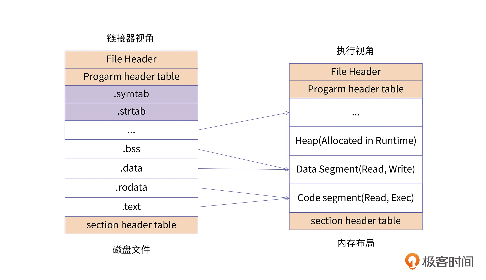
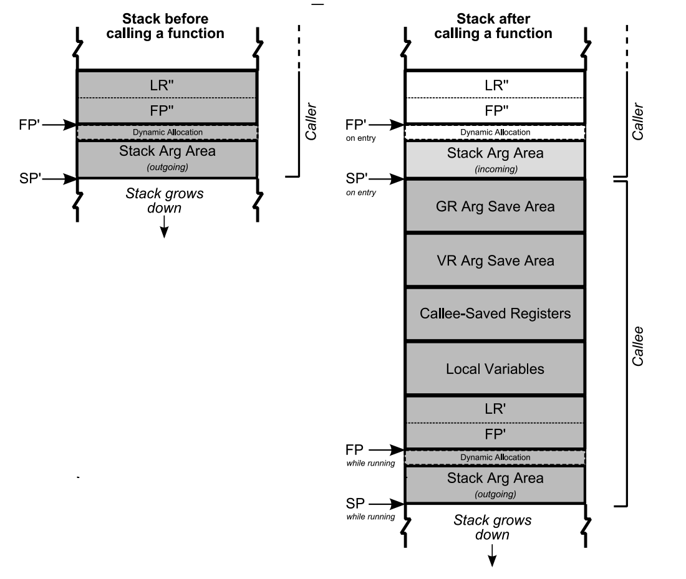

# 内存

As it turns out, allocating memory is the easy part of the equation; knowing when, how, and even if to free memory is the hard part.

1. 遗漏释放 —— 内存泄漏
2. 重复释放 —— 崩溃
3. 过早释放 —— 使用释放后的内存导致段错误

内存溢出，内存宕机，堆栈破坏

Java 虚拟机的优化 —— 垃圾回收，解决了重复释放和过早释放的问题，将问题变成了

- 持有引用，无法释放的问题

同时引入了另一个问题 —— 垃圾回收时导致“世界暂停”


## 内存模型

内存分布，各个区域的分布，各个部分使用容易引起的问题

内存模型主要关注于多线程对内存的访问 https://stackoverflow.com/questions/6319146/c11-introduced-a-standardized-memory-model-what-does-it-mean-and-how-is-it-g

## 检测工具

native 检测工具 ASan
java 检测工具 profile

1. 开发注意、避免
2. 运行检测
3. 线上监控


极客时间关于内存部分的文章
OS 关于内存部分的


Truman 的问题排查

# Native

Native 类型的程序，都具有如下的内存区域。其它虚拟机程序，也基本是这几种类型的区域。只不过有的叫法不同（例如 Java 把代码区区域称为方法区，由于 Java 动态加载字节码，其方法区很可能是虚拟机的堆区）。

1. 代码区 （.text段） ：
    存放代码（如函数），不允许修改（类似常量存储区），但可以执行（不同于常量存储区）

2. 常量存储区 （.rodata段） ：
    存放常量，不允许修改（通过非正当手段也可以修改）。其实就是值编码在可执行文件中，接该部分数据直接加载到内存即可。

3. 全局/静态存储区 （.bss段和.data段） ：
    全局和静态变量被分配到同一块内存中。在C语言中，未初始化的放在.bss段中，初始化的放在.data段中；在C++里则不区分了。

    对于未初始化的全局变量和静态变量，因为编译器知道它们的初始值都是 0，因此便不需要再在程序的二进制映像中存放这么多 0 了，只需要记录他们的大小即可，这便是 BSS 段。Block Started by Symbol，但很多人可能更喜欢把它记作 Better Save Space 的缩写。

4. 堆 heap ：“缓冲区溢出”、“内存泄露”

5. 栈 stack ：栈溢出（递归调用函数）

> 用户空间个区域的用处和特性，从低地址开始

- text 代码段，该区域是只读的，但是由于历史原因，地址并不是从 0 开始，需要留一部分空间给启动器等内容，例如 x86 的地址。

- 数据区域用于存放程序全局数据和静态数据，根据细分可以分为：
    - 常量存储区：.rodata，例如 C++ 的虚函数表就是放在这个区域。
    - 数据存储区：.data, 存放初始化过的数据
    - 未初始化数据区：.bss, 存放未初始化的数据（统一初始化为0，不占程序文件的空间）。

- heap 堆区：堆区使用更灵活，可以随时动态申请，例如 C 中 malloc 和 C++ new 的对象。也是最容易出问题的地方，因为这部分的管理部分权限转移给了用户。

- mmap 内存映射区：包括文件映射和匿名内存映射， 应用程序的所依赖的动态库，会在程序执行时候，加载到内存这个区域，一般包括数据（data）和代码（text）;通过mmap系统调用，可以把特定的文件映射到内存中，然后在相应的内存区域中操作字节来访问文件内容，实现更高效的IO操作；匿名映射，在 glibc 中 malloc 分配大内存的时候会用到匿名映射。这里所谓的“大”表示是超过了MMAP_THRESHOLD 设置的字节数，它的缺省值是 128 kB，可以通过 mallopt() 去调整这个设置值。还可以用于进程间通信IPC（共享内存）。

- stack 栈区：专门用来实现函数调用结构的内存块。**系统需要为每个线程分配一个栈**（可以设置大小，Linux 一般默认是8M，一般主线程和普通线程也有差别，可通过 ulimit 查看），栈空间是根据约定由编译器生成的代码自动由高地址向低地址增加。


除了上面所讲的基本内存区域外，**现代应用程序**中还会包含其他的一些内存区域，主要有以下几类：
- **存放加载的共享库的内存空间**：如果一个进程依赖共享库，那对应的，该共享库的代码段、数据段、BSS 段也需要被加载到这个进程的地址空间中。

- **共享内存段**：我们可以通过系统调用映射一块匿名区域作为共享内存，用来进行进程间通信。

- **内存映射文件**：我们也可以将磁盘的文件映射到内存中，用来进行文件编辑或者是类似共享内存的方式进行进程通信。这样我们就初步了解了一个进程内存中需要哪些区域。


> 都是数据，为什么需要分为常量区、初始化、未初始化的分区？
这是因为不同数据保存的内容和需要做的操作不同：

- 对于常量存储区，其值直接编码在可执行文件中，直接加载到内存即可，而且，因为是常量，其页属性可以设置为 `可读不可的`。

- 对于未初始化的全局变量和静态变量，因为不用保存其值，为了减少可执行文件的大小，只需要记录其大小，加载到内存时再申请相应的空间即可。

- 对于初始化的变量，可执行文件保存的也是其值，但是加载到内存中，其页属性需要是 `可读可写`的。


在上面的讨论中，我们并没有区分磁盘的程序段 (Section)，以及内存程序段 (Segment) 的概念，这两个词在国内往往都被翻译成“段”，导致大多数同学会混淆它们。这里我来给你做一个区分。



上图从两个视角展示了应用程序的分布，左边是程序在磁盘中的文件布局结构，右边是程序加载到内存中的内存布局结构。

对于磁盘的程序，每一个单元结构称为 Section。我们可以通过 readelf -S 的选项，来查看二进制文件中所有的 Section 信息。对于右边的内存镜像，每一个单元结构称为 Segment。我们可以通过 readelf -l 的选项，来查看二进制文件加载到内存之后的 Segment 布局信息。

同时我们也可以看到，往往多个 Section 会对应一个 Segment，例如.text、.rodata 等一些只读的 Section，会被映射到内存的一个只读 / 执行的 Segment 里；而.data、.bss 等一些可读写的 Section，则会被映射到内存的一个具有读写权限的 Segment 里。并且对于磁盘二进制中一些辅助信息的 Section，例如.symtab、.strtab 等，不需要在内存中进行映射。

总的来说，Section 主要是指在磁盘中的程序段，而 Segment 则用来指代内存中的程序段，Segment 是将具有相同权限属性的 Section 集合在一起，系统为它们分配的一块内存空间。


根据 C++ 对象生命周期不同，C++ 的内存模型有三种不同的内存区域:

1.自由存储区，动态区、静态区局部非静态变量的存储区域(栈)

2.动态区:用operator new,malloc分配的内存(堆)

3.静态区:全局变量、静态变量、字符串常量存在位置

需要理解
- C++标准对象模型
- C++标准库
- 标准C库
- 操作系统等内存设计

才能更加深入理解C++内存管理


## Native 程序内存布局(虚拟地址空间)

查看地址空间 `cat  /proc/cpuinfo`
```
address sizes	: 39 bits physical, 48 bits virtual
```
虽然是 64 位的机器，但是仍然仅有 48 位地址在使用，也即 64 为 Linux 支持 256TB( 2^48 ) 的虚拟地址空间。这台机器上有 `39` 位的真实物理地址，也即 512 G，其实是硬盘容量。

这里仅以 Linux 上的内存布局为例，内存中各个类型的顺序和地址可能不同，但是都具有以上五种类型的存储区域。

| Addres | 70 | 60 | 50 | 40 | 30 | 20 | 10 |
| ------ | -- | -- | -- | -- | -- | -- | -- |
| Unit   | EB | EB | PB | TB | GB | MB | KB |

2^32 = 2^2 * 2^30 = 4 GB
2^64 = 2^4 * 2^60 = 16 EB
2^48 = 2^8 * 2^40 = 256 TB

但是 `Android ARM ` 系统 `/proc/cpuinfo` 中并没有 `address sizes` 信息。[在 Linux 官方的文档中](https://www.kernel.org/doc/Documentation/arm64/memory.txt)，我们知道 ARM 64 位支持 `39bits`, `48bits` 的地址空间。支持 `ARMv8.2-LVA` 特性的 [ARM 甚至支持 `52bits` 的地址空间。](https://www.kernel.org/doc/html/latest/arm64/memory.html#)

```
AArch64 Linux memory layout with 4KB pages + 3 levels:

Start			End			Size		Use
-----------------------------------------------------------------------
0000000000000000	0000007fffffffff	 512GB		user
ffffff8000000000	ffffffffffffffff	 512GB		kernel

```
通过 `cat /proc/self/maps` 打印的地址空间我们作为对比:

```
5f4e452000-5f4e47d000 r--p 00000000 fd:0e 507                            /system/bin/toybox
...
7373b21000-7373b27000 rw-p 00000000 00:00 0                              [anon:.bss]
7fd53d5000-7fd53f6000 rw-p 00000000 00:00 0                              [stack]
```
打印的地址空间是 `40` bits, 栈空间位域末尾，`7fd53d5000-7f d53f 6000` 的地址说明地址空间最大为 `7f ffff ffff`，之所以不严格是 `7f ffff ffff` 结束，是因为为例防止基于地址的攻击，比如栈溢出攻击和堆溢出攻击等，Linux在特定段之间使用随机偏移，使段的起始地址是随机值, Linux 系统上的ASLR 等级可以通过文件 `/proc/sys/kernel/randomize_va_space` 来进行设置，它支持以下取值：

- 0 - 关闭的随机化。每次分配的地址将保持一致。
- 1 - 保守的随机化。共享库、栈、mmap()、VDSO以及堆将被随机化。
- 2 - 完全的随机化。除了上面列举的要素外，通过 brk() 分配得到的内存空间也将被随机化。

可以通过 `sudo sysctl -w kernel.randomize_va_space=val` 的命令来修改设置。


[39 位地址空间的 64 位 Android 系统的虚拟内存布局。](https://stackoverflow.com/questions/51928583/how-to-intepret-the-virtual-kernel-memory-layout-on-arm64)
```
--------------------> +--------------------------+                           +--------------------------+<--------------
ffff:ffff:ffff:ffff   |                          |                          /|     Main thread stack    |         Stack
                      |                          |                        /  +==========================+<--------------
                      |                          |                      /    +       Other stacks       +           ∨
ffff:ffc0:0000:0000   |----- Kernel (512G)-------| <-- PAGE_OFFSET    /      |            :             |
                      |                          |                  /        +==========================+<---------------
                      |                          |                /          |            :             |          mmap
ffff:ff80:0000:0000   |                          |              /            +--------------------------+<--------------
--------------------> +--------------------------+            /              z                          z           ∨
ffff:ff7f:ffff:ffff   |//////////////////////////|          /                z                          z
                      z //////////////////////// z        /                  z                          z
                      z //////////////////////// z      /                    z                          z
                      z //////////////////////// z    /                      |                          |
0000:0080:0000:0000   |//////////////////////////|  /                        |                          |
--------------------> +--------------------------+/                          |                          |           ∧
0000:007f:ffff:ffff   |                          |                           +--------------------------+<--------------
                      |                          |                           |          heap            |
                      |                          |                           +--------------------------+
                      |      User (512G)         |                           | data(.rodata,.bss,.data )|
                      |                          |                           +--------------------------+
                      |                          |                           |          text            |
0000:0000:0000:0000   |                          |                           +--------------------------+
--------------------> +--------------------------+ - - - - - - - - - - - - > +--------------------------+
```

这里以安卓系统 ARM 39bits 的地址空间为例，不同地址控制的内存占用不同，例如，39bits 的用户空间为 256GB，48bits 地址空间时 4 级 4KB 页大小用户空间 256TB，2 级 64KB 页大小用户空间为 4TB。具体平台的实际地址空间使用 `cat  /proc/cpuinfo` 和 `cat /proc/self/maps` 结合实际，具体分析。**虽然空间大小不同，但实际的布局顺序是一致的**


32 位内存布局
```
--------------------> +--------------------------+
ffff:ffff             |                          |
                      |----- Kernel ( 1G )-------|
c000:0000             |                          |
--------------------> +--------------------------+
bfff:ffff             |                          |
                      |                          |
                      |                          |
                      |      User ( 3G )         |
                      |                          |
                      |                          |
0000:0000             |                          |
--------------------> +--------------------------+
```

32 位内存的用户空间的布局和 64 位内存的布局顺序一致，只不过地址空间更小。另外 64 位机能够兼容 32 位的程序，在运行 32 位程序时，内核空间仍然是 64 位机的样子，但是程序仅占低地址空间的 4 G 内存。具体查看 https://www.cnblogs.com/zengkefu/p/6783456.html


每个段都有特定的安全控制（权限），在使用 cat `cat /proc/<self/process id>/maps` 查看具体进程的内存应分配时，第二列(vm_flags)就是权限：

```
 $ cat /proc/self/maps
5f4e452000-5f4e47d000 r--p 00000000 fd:0e 507                            /system/bin/toybox
5f4e47d000-5f4e4c0000 r-xp 0002b000 fd:0e 507                            /system/bin/toybox
...
7373b21000-7373b27000 rw-p 00000000 00:00 0                              [anon:.bss]
7fd53d5000-7fd53f6000 rw-p 00000000 00:00 0                              [stack]
```
/proc/{pid}/maps文件各字段含义：地址范围、访问权限、文件中的偏移量、设备、inode、支持映射的文件路径名；

一共四个字符，顺序是 `rwx[p/s]`
- r表示可读
- w表示可写
- x表示可执行
- p和s共用一个字段，互斥关系，p表示私有段，s表示共享段，如果没有相应权限，则用’-’代替。

/proc/{pid}/smaps文件记录的是内存映射的详细信息：第一行同maps文件，其余行表示：内存大小、Rss、Pss、Shared_Clean、Shared_Dirty、Private_Clean、Private_Dirty、Referenced、Anonymous、AnonHugePages、ShmemHugePages、ShmemPmdMapped、Swap、KernelPageSize、MMUPageSize、Locked、ProtectionKey、VmFlags等。


下面介绍几个查看内存使用情况的技巧或者命令：

1. 查看内存的

free 用于查看物理内存的使用情况。除此外 `/proc/meminfo` 也提供了相关的物理内存使用情况。

在 Linux 上，可以使用 `cat /proc/self/maps` 和 `cat /proc/$$/maps` 获得更多内存信息。

```
RMX2025CN:/ $ cat /proc/9919/mem
cat: /proc/9919/mem: I/O error
1|RMX2025CN:/ $ cat /proc/9919/maps
5df30da000-5df30e5000 r--p 00000000 fd:0e 459                            /system/bin/sh      // 代码段
...
5df3125000-5df3127000 rw-p 00000000 00:00 0                              [anon:.bss]         // bss 段
6f70b4c000-6f70e3b000 ---p 00000000 00:00 0                              [anon:cfi shadow]
...
//程序的内存映射区，主要是动态库加载到该内存区，包括动态库的text代码段和数据data段。
//中间没有名字的，属于程序的匿名映射段，主要提供大内存分配。
6ff0b4c000-6ff0b97000 r--p 00000000 fd:0e 2128                           /system/lib64/libc++.so  // 动态库
...
6ff0bf8000-6ff0bfb000 rw-p 00000000 00:00 0                              [anon:.bss]              // 动态库的数据区
6ff0c00000-6ff1000000 rw-p 00000000 00:00 0                              [anon:libc_malloc]       // 动态库的动态申请的内容
6ff1045000-6ff1056000 r--p 00000000 07:d0 36                             /apex/com.android.runtime/lib64/bionic/libm.so
6ff1056000-6ff107a000 r-xp 00011000 07:d0 36                             /apex/com.android.runtime/lib64/bionic/libm.so
6ff107a000-6ff107b000 r--p 00035000 07:d0 36                             /apex/com.android.runtime/lib64/bionic/libm.so
6ff107b000-6ff107c000 rw-p 00035000 07:d0 36                             /apex/com.android.runtime/lib64/bionic/libm.so
6ff10b1000-6ff10b4000 r--p 00000000 fd:0e 2294                           /system/lib64/libnetd_client.so
6ff10b4000-6ff10b8000 r-xp 00003000 fd:0e 2294                           /system/lib64/libnetd_client.so
6ff10b8000-6ff10b9000 r--p 00007000 fd:0e 2294                           /system/lib64/libnetd_client.so
6ff10b9000-6ff10ba000 rw-p 00007000 fd:0e 2294                           /system/lib64/libnetd_client.so
6ff10ff000-6ff111f000 r--s 00000000 00:10 10151                          /dev/__properties__/u:object_r:heapprofd_prop:s0
6ff111f000-6ff113f000 r--s 00000000 00:10 10119                          /dev/__properties__/u:object_r:exported2_default_prop:s0
6ff113f000-6ff115f000 r--s 00000000 00:10 10097                          /dev/__properties__/u:object_r:debug_prop:s0
6ff115f000-6ff11c3000 rw-p 00000000 00:00 0                              [anon:linker_alloc]
6ff11c3000-6ff11c4000 r--p 00000000 07:d0 34                             /apex/com.android.runtime/lib64/bionic/libdl.so
6ff11c4000-6ff11c5000 r-xp 00001000 07:d0 34                             /apex/com.android.runtime/lib64/bionic/libdl.so
6ff11c5000-6ff11c6000 r--p 00002000 07:d0 34                             /apex/com.android.runtime/lib64/bionic/libdl.so
6ff11c6000-6ff11c7000 ---p 00000000 00:00 0
6ff11c7000-6ff11c8000 r--p 00000000 00:00 0                              [anon:.bss]
6ff11d4000-6ff11f4000 r--s 00000000 00:10 13409                          /dev/__properties__/properties_serial
6ff11f4000-6ff1209000 r--s 00000000 00:10 10050                          /dev/__properties__/property_info
6ff1209000-6ff124c000 r--p 00000000 07:d0 33                             /apex/com.android.runtime/lib64/bionic/libc.so
6ff124c000-6ff12ea000 r-xp 00043000 07:d0 33                             /apex/com.android.runtime/lib64/bionic/libc.so
6ff12ea000-6ff12f0000 r--p 000e1000 07:d0 33                             /apex/com.android.runtime/lib64/bionic/libc.so
6ff12f0000-6ff12f2000 rw-p 000e6000 07:d0 33                             /apex/com.android.runtime/lib64/bionic/libc.so
6ff12f2000-6ff12f6000 rw-p 00000000 00:00 0                              [anon:.bss]
6ff12f6000-6ff12f7000 r--p 00000000 00:00 0                              [anon:.bss]
6ff12f7000-6ff12fc000 rw-p 00000000 00:00 0                              [anon:.bss]
6ff1353000-6ff1373000 r--s 00000000 00:10 13386                          /dev/__properties__/u:object_r:vendor_socket_hook_prop:s0
6ff1373000-6ff143b000 r--p 00000000 00:00 0                              [anon:linker_alloc]
6ff143b000-6ff145b000 r--s 00000000 00:10 13405                          /dev/__properties__/u:object_r:vndk_prop:s0
6ff145b000-6ff145d000 rw-p 00000000 00:00 0                              [anon:bionic_alloc_small_objects]
6ff145e000-6ff1460000 rw-p 00000000 00:00 0                              [anon:bionic_alloc_small_objects]
6ff1461000-6ff1463000 rw-p 00000000 00:00 0                              [anon:bionic_alloc_small_objects]
6ff1464000-6ff1466000 rw-p 00000000 00:00 0                              [anon:bionic_alloc_small_objects]
6ff146a000-6ff146d000 rw-p 00000000 00:00 0                              [anon:System property context nodes]
6ff146d000-6ff146e000 ---p 00000000 00:00 0
6ff146e000-6ff1472000 rw-p 00000000 00:00 0                              [anon:stack_and_tls:main]
6ff1472000-6ff1473000 ---p 00000000 00:00 0
6ff1473000-6ff1476000 rw-p 00000000 00:00 0                              [anon:bionic_alloc_small_objects]
6ff1477000-6ff1480000 rw-p 00000000 00:00 0                              [anon:bionic_alloc_small_objects]
6ff1480000-6ff14e4000 r--p 00000000 00:00 0                              [anon:linker_alloc]
6ff14e4000-6ff1504000 r--s 00000000 00:10 10097                          /dev/__properties__/u:object_r:debug_prop:s0
6ff1504000-6ff1524000 r--s 00000000 00:10 10119                          /dev/__properties__/u:object_r:exported2_default_prop:s0
6ff1524000-6ff1525000 ---p 00000000 00:00 0
6ff1525000-6ff152d000 rw-p 00000000 00:00 0
6ff152d000-6ff152e000 ---p 00000000 00:00 0
6ff152e000-6ff154e000 r--s 00000000 00:10 13409                          /dev/__properties__/properties_serial
6ff154e000-6ff1551000 rw-p 00000000 00:00 0                              [anon:System property context nodes]
6ff1551000-6ff1566000 r--s 00000000 00:10 10050                          /dev/__properties__/property_info
6ff1566000-6ff15ca000 r--p 00000000 00:00 0                              [anon:linker_alloc]
6ff15ca000-6ff15cc000 rw-p 00000000 00:00 0                              [anon:bionic_alloc_small_objects]
6ff15cc000-6ff15cd000 r--p 00000000 00:00 0                              [anon:atexit handlers]
6ff15cd000-6ff19f8000 ---p 00000000 00:00 0
6ff19f8000-6ff19fa000 rw-p 00000000 00:00 0
6ff19fa000-6ff25cd000 ---p 00000000 00:00 0
6ff25cd000-6ff25ce000 ---p 00000000 00:00 0
6ff25ce000-6ff25d6000 rw-p 00000000 00:00 0                              [anon:thread signal stack]
6ff25d6000-6ff25d7000 rw-p 00000000 00:00 0                              [anon:arc4random data]
6ff25d8000-6ff25d9000 r--p 00000000 00:00 0                              [anon:atexit handlers]
6ff25d9000-6ff25da000 rw-p 00000000 00:00 0                              [anon:arc4random data]
//vvar page，kernel的一些系统调用的数据会映射到这个页面，用户可以直接在用户空间访问；
6ff25da000-6ff25db000 r--p 00000000 00:00 0                              [vvar]
// vDSO -virtual dynamic shared object,is a small shared library exported by the kernel to accelerate the execution
// of certain system calls that do not necessarily have to run in kernel space, 就是内核实现了glibc的一些系统调用，然后可
// 以直接在用户空间执行,提高系统调用效率和减少与glibc的耦合。
6ff25db000-6ff25dc000 r-xp 00000000 00:00 0                              [vdso]
6ff25dc000-6ff260d000 r--p 00000000 07:d0 14                             /apex/com.android.runtime/bin/linker64
6ff260d000-6ff26c2000 r-xp 00031000 07:d0 14                             /apex/com.android.runtime/bin/linker64
6ff26c2000-6ff26c9000 r--p 000e6000 07:d0 14                             /apex/com.android.runtime/bin/linker64
6ff26c9000-6ff26cb000 rw-p 000ec000 07:d0 14                             /apex/com.android.runtime/bin/linker64
6ff26cb000-6ff26cf000 rw-p 00000000 00:00 0                              [anon:.bss]
6ff26cf000-6ff26d0000 r--p 00000000 00:00 0                              [anon:.bss]
6ff26d0000-6ff26d6000 rw-p 00000000 00:00 0                              [anon:.bss]
// 栈空间
7ffdb98000-7ffdbb9000 rw-p 00000000 00:00 0                              [stack]
```

或者
```
$ pmap 9919
9919:   /proc/9919/mem
0000000000400000      4K r---- a.out
0000000000401000      4K r-x-- a.out
0000000000402000      4K r---- a.out
...
```

没看到有，待定：对于 64 位的程序，你在查看 /proc/pid/maps 的过程中，会发现代码段跟数据段的中间还有一段不可以读写的保护段，它的作用也是防止程序在读写数据段的时候越界访问到代码段，这个保护段可以让越界访问行为直接崩溃，防止它继续往下运行。


### 代码区，数据区

这两部分主要是编译过程中就确定了，很简单，也基本不会出什么问题，不需要太关注。

### 堆

堆内存的使用更灵活，也是出问题最多的地方，因为内存的管理不是完全自动的：虽然分配需要向内存申请，但是释放的权利却在用户手中。

C++ new 做了两件事：
1. 调用 `operator new` 分配内存。本质是低啊用 `malloc()`。
2. 调用构造函数初始化内存。

delete 的顺序跟 new 相反：
1. 调用对象的析构函数。
2. 调用 `operator delete` 释放内存。本质上是 `fres()`。

`operator new` 和 `operator delete` 定义在标准库中，由各个平台实现。以 Android 使用的 bionic 为例：

```C++
// bionic/new.cpp
void* operator new(std::size_t size) {
    void* p = malloc(size);
    if (p == nullptr) {
        async_safe_fatal("new failed to allocate %zu bytes", size);
    }
    return p;
}

void* operator new[](std::size_t size) {
    void* p = malloc(size);
    if (p == nullptr) {
        async_safe_fatal("new[] failed to allocate %zu bytes", size);
    }
    return p;
}

void  operator delete(void* ptr) throw() {
    free(ptr);
}

void  operator delete[](void* ptr) throw() {
    free(ptr);
}
```
更详细的内容可以查看
http://www.cplusplus.com/reference/new/operator%20new/
http://en.cppreference.com/w/cpp/memory/new/operator_new

思考问题：

1  malloc和free是怎么实现的？

2  malloc 分配多大的内存，就占用多大的物理内存空间吗？

3  free 的内存真的释放了吗（还给 OS ） ?

4  既然堆内内存不能直接释放，为什么不全部使用 mmap 来分配？

5  如何查看堆内内存的碎片情况？

6  除了 glibc 的 malloc/free ，还有其他第三方实现吗？

> my question

1. 如何获取堆的起始地址以及堆大小？
https://stackoverflow.com/questions/23937837/c-c-why-is-the-heap-so-big-when-im-allocating-space-for-a-single-int
2. 如果知道已申请的堆哪些空间被分配了（libc 中整块申请，再细分给用户，可能已经从系统申请，但是还没给用户）？

3. 没看到呢？出现一直递归调用回不来的情况，这样栈上就会出现很多 fac 的帧栈，会造成栈空间耗尽，出现 StackOverflow。这里的原理是，操作系统会在栈空间的尾部设置一个禁止读写的页，一旦栈增长到尾部，操作系统就可以通过中断探知程序在访问栈末端。


### mmap

### 栈

栈为什么要由高地址向低地址扩展，堆为什么由低地址向高地址扩展？

历史原因：在没有MMU的时代，为了最大的利用内存空间，堆和栈被设计为从两端相向生长。人们对数据访问是习惯于从地址小的位置开始，比如你在堆中申请一个数组，是习惯于把低元素放到低地址，把高位放到高地址，所以堆向上生长比较符合习惯,  而栈则对方向不敏感，一般对栈的操作只有 PUSH 和 pop，无所谓向上向下，所以就把堆放在了低端，把栈放在了高端. 但现在已经习惯这样了。这个和处理器设计有关系，目前大多数主流处理器都是这样设计，但ARM 同时支持这两种增长方式。

函数调用的参数和局部数据都会放在栈中。首先看参数传递：


[栈的使用涉及到以下几个方面](https://www.cs.princeton.edu/courses/archive/spr19/cos217/lectures/15_AssemblyFunctions.pdf)

1. 调用和返回
    - 如何跳到被调用的函数执行？
    - 如何从被调用函数返回调用者？
2. 传递参数
    - 如何传递参数给被调用函数
3. 局部变量
    - 被调用函数如何存储局部变量？
4. 返回值
    - 被调用函数如何将值返回给调用者？
    - 调用者如何获得返回的值？
5. 优化
    - 调用者和被调用函数如何做到最小的内存占用？


```
Low                   |                          |
                      +--------------------------+
SP -----------------> |                          |
                      +--------------------------+
                      |          ARGS            |
                      |          ARGS            |
                      |          ARGS            |
                      +==========================+
FP -----------------> |           FP'            |
                      +--------------------------+
                      |           IR'            |
High                  |                          |
```

BP: 栈底指针
LR(Link Register): 函数返回地址 (arm: x30, )
FP(Frame Pointer): 栈帧指针 (arm: r29, x86: rbp)
SP(Stak Pointer):  栈顶指针 （arm：sp）

以计算两个数字绝对值的和为例：
```C
int test() {
    return testCall(2, 4);
}

test:
	stp	x29, x30, [sp, #-16]! // SP = SP - 16; PUSH FP, LR
	mov	x29, sp               // FP = SP
	mov	w0, #2
	mov	w1, #4
	bl	testCall              // JUMP testCall; LR = .bl_ret
.bl_ret:
	ldp	x29, x30, [sp], #16   //
	ret
```

#### 1. 调用和返回

如何从调用者次跳到被调用函数？即，跳到被调用者第一条指令的地址。

被调用方法如何跳转回调用者的正确位置？即跳到执行跳转到被调用方法的指令后面最近的指令。

> 栈空间大小

系统的栈空间并不是一个统一的值（特别是不同系统，或者不同 CPU 平台），但是也有一般的


BL: 绝对跳转 #imm，并将返回地址（下一跳指令的地址）保存到 LR(x30)

```
stp x29, x30 ,[sp, #-0x10]! 加 “！” 的作用相当于：
sub sp, sp, #0x10
stp x29, x30, [sp]
```




#### 2. 传递参数

通用的做法是入栈，而 ARM 的做法稍有不同：

- 前 8 个参数（integer or address）保存在寄存器中，以提高效率。
    - X0..X7（64 位） and/or W0..W7（32 位）
- 多余 8 个参数或者非简单数据类型放到栈中

被调用函数
- 将寄存器传入的参数保存到栈中或者直接使用（优化）。
- 被调用函数通过 `SP+正偏移` 获取参数。


#### 3. 局部变量


**在不同语言的编译器中，调用参数压栈的顺序，参数栈的弹出，名字修饰是不同的。例如 c/c++ 的参数是从由向左开始压栈，由调用方负责弹出，命名修饰使用 `下划线 + 函数名`**

#### 栈攻击

由上面栈内存布局可以看出，栈很容易被破坏和攻击，通过栈缓冲器溢出攻击，用攻击代码首地址来替换函数帧的返回地址，当子函数返回时，便跳转到攻击代码处执行,获取系统的控制权，所以操作系统和编译器采用了一些常用的防攻击的方法：

- ASLR(地址空间布局随机化)：操作系统可以将函数调用栈的起始地址设为随机化（这种技术被称为内存布局随机化，即Address Space Layout Randomization (ASLR) ），加大了查找函数地址及返回地址的难度。

- Cannary

[clang/gcc 的编译参数](https://clang.llvm.org/docs/ClangCommandLineReference.html#cmdoption-clang-fstack-protector-strong)

| 编译参数                                 |  作用                                                       |
| -                                       | -                                                          |
| -fstack-protector, -fno-stack-protector | 开启或者关闭栈保护，只有带有 char 数组局部变量的函数才会插入保护代码。|
| -fstack-protector-all                   | 对所有函数开启堆栈保护                                         |
| -fstack-protector-strong                | 和 -fstack-protector 一样，增加对函数内有数组定义，对局部站上地址引用的函数的保护 |

开启Canary之后，函数开始时在ebp和临时变量之间插入一个随机值，函数结束时验证这个值。如果不相等（也就是这个值被其他值覆盖了），就会调用 _stackchk_fail函数，终止进程。对应GCC编译选项-fno-stack-protector解除该保护。

- NX.
  NX 即 No-eXecute（不可执行）的意思，NX（DEP）的基本原理是将数据所在内存页标识为不可执行，当程序溢出成功转入shellcode时，程序会尝试在数据页面上执行指令，此时CPU就会抛出异常，而不是去执行恶意指令。gcc编译器默认开启了NX选项，如果需要关闭NX选项，可以给gcc编译器添加 `-z execstack`参数。 `-z` 其实是将 `execstack` 传给连接器，clang 的连接器并没有使用该选项。


```C
int testCall(int a) {
    return a + 5;
}

// -fstack-protector-all

testCall(int):                           // @testCall(int)
        sub     sp, sp, #32                     // =32
        stp     x29, x30, [sp, #16]             // 16-byte Folded Spill
        add     x29, sp, #16                    // =16
        adrp    x8, __stack_chk_guard
        ldr     x8, [x8, :lo12:__stack_chk_guard]

        str     x8, [sp, #8]
        str     w0, [sp, #4]
        ldr     w9, [sp, #4]
        add     w0, w9, #5                      // =5

        adrp    x8, __stack_chk_guard
        ldr     x8, [x8, :lo12:__stack_chk_guard]
        ldr     x10, [sp, #8]
        subs    x8, x8, x10
        str     w0, [sp]                        // 4-byte Folded Spill
        b.ne    .LBB0_2
        ldr     w0, [sp]                        // 4-byte Folded Reload
        ldp     x29, x30, [sp, #16]             // 16-byte Folded Reload
        add     sp, sp, #32                     // =32
        ret
.LBB0_2:
        bl      __stack_chk_fail
```

#### 栈异常处理

一个函数（或方法）抛出异常，那么它首先将当前栈上的变量全部清空(unwinding)，如果变量是类对象的话，将调用其析构函数，接着，异常来到call stack的上一层，做相同操作，直到遇到catch语句。

**指针是一个普通的变量，不是类对象，所以在清空call stack时，指针指向资源的析构函数将不会调用。** 需要格外注意。


Nowadays Magisk is commonly used for rooting.

牛逼的Linux性能剖析—perf

- 查看该进程的 maps 和 smaps 文件。并解释细节
- 查找资料，确认 /proc 目录下面各个文件的作用。

> 页表存在哪里？

1. 所有进程的页表都是关键数据，只有内核才有权限修改，所以页表都是存在内核空间的。每个进程的管理结构里（也在内核空间）都会记录自己的页表。
2. 进程切换时会把目标进程的页表起始地址送进cr3寄存器，这样目标进程页表就可以起作用了。显然这个也只能在内核里才能做。

映射的过程，是由 CPU 的内存管理单元 (Memory Management Unit, MMU) 自动完成的，但它依赖操作系统设置的页表。


https://www.cnblogs.com/sevenyuan/p/13305420.html

安卓 art 内存管理， https://developer.android.com/topic/performance/memory-overview


PIC PIE
https://blog.csdn.net/zat111/article/details/46738649
https://mropert.github.io/2018/02/02/pic_pie_sanitizers/
https://www.anquanke.com/post/id/177520#h2-4


http://thinkiii.blogspot.com/2014/02/arm64-linux-kernel-virtual-address-space.html
[Arm64 内存分配](https://www.kernel.org/doc/html/latest/arm64/memory.html)
[Arm64 支持的页面大小](https://www.kernel.org/doc/Documentation/arm64/memory.txt)
[Virtual kernel memory layout 是内核启动时打印的，已经被删掉了](https://blog.csdn.net/yhb1047818384/article/details/104621500)